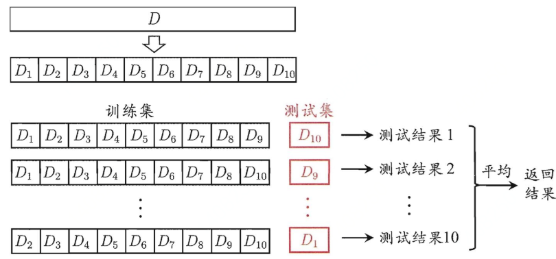

# 概念

根据数据是否有标记信息，学习任务可以分为**监督学习**和**无监督学习**。

# 名词（基本术语）

1. 监督学习：分类与回归

2. 无监督学习：聚类

3. 泛化（generalization）能力：所学习的模型适用于新样本能力

4. 精度：1-错误率，错误率=1-错误个数/样本总数

5. 训练误差（经验误差）：实际预测与真实输出之间的误差

6. 泛化误差：对新样本的误差

7. 过拟合：只能缓解，不能完全解决

8. 欠拟合：决策树扩展分支，神经网络增加训练轮数

9. 训练集：用于训练模型，S

10. 测试集：用于测试训练模型，T

11. 留出法：划分数据集方法，S与T不相交，

    1. **尽可能保证数据分布的一致性，避免引入额外的偏差**
    2. **S与T的划分，采用多次随机划分，重复实验评估**，S占2/3-4/5左右

12. 交叉验证法

    

13. 留一法

    交叉验证法的特例，即选取一个的训练集只比原始数据集少一个样本，通常训练出的模型与期望评估的模型最接近，评估结果也最准确。

    - 样本数据量大时，计算开销过大

14. 自助法

    数据集D中取一个样本作为训练集中的元素，然后把该样本放回，重复该行为m次，这样我们就可以得到大小为m的训练集，在这里面有的样本重复出现，有的样本则没有出现过，我们把那些没有出现过的样本作为测试集。该样本都不会被采到的概率为
    $$
    (1−1/m)^m
    $$
    那么取极限有
    $$
    \lim_{n\rightarrow\infty}(1-1/m)^m = \frac{1}{e}=0.368
    $$
    
    $$
    \lim_{n\rightarrow+\infty}
    $$
    因此我们可以认为在D中约有36.8%的数据没有在训练集中出现过。

# 总结

1. 对于数据量充足的时候，通常采用**留出法**或者**k折交叉验证法**来进行训练/测试集的划分；
2. 对于数据集小且难以有效划分训练/测试集时使用**自助法**；
3. 对于数据集小且可有效划分的时候最好使用**留一法**来进行划分，因为这种方法最为准确